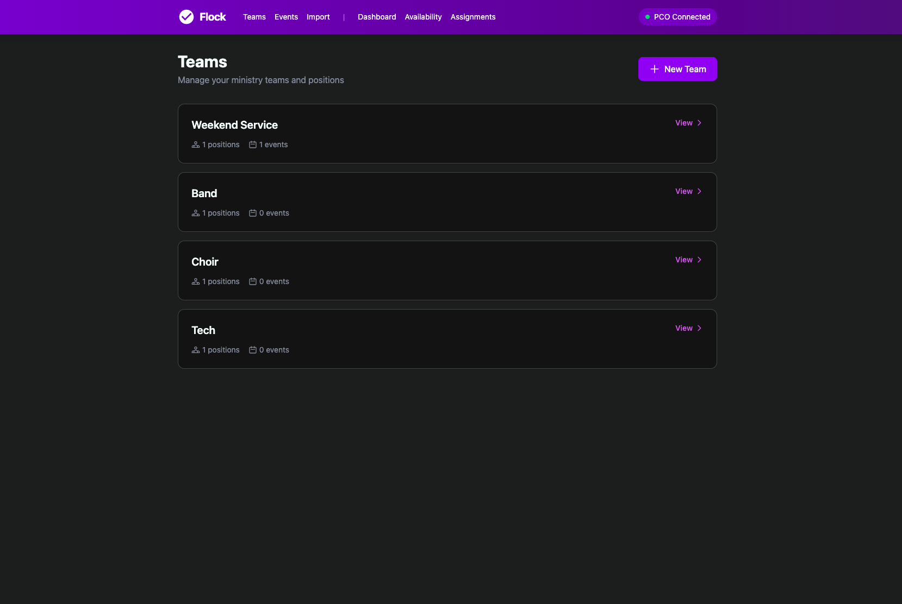
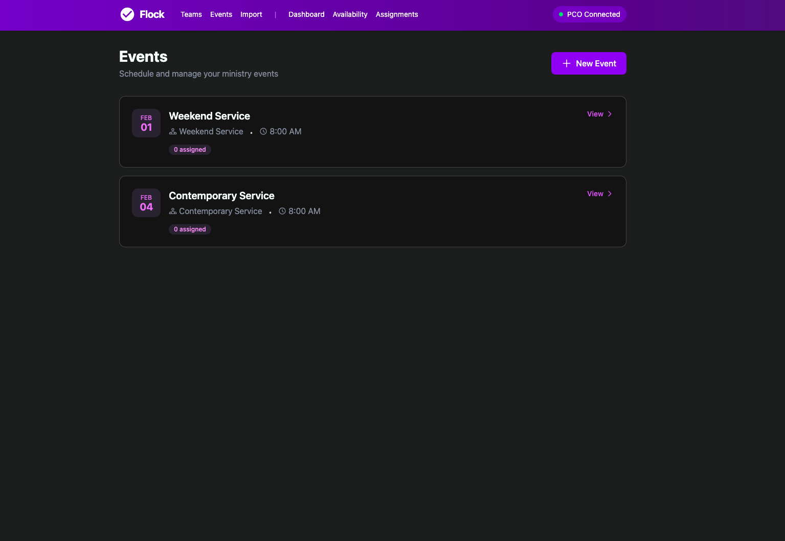
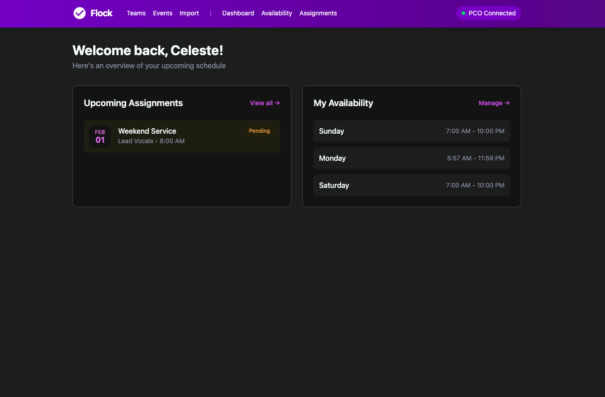

# Flock

Volunteer scheduling for churches — integrates with Planning Center.


## Features

- **Team & Position Management** — Create ministry teams and define volunteer positions
- **Event Scheduling** — Schedule events and assign volunteers to positions
- **Availability Management** — Volunteers set their weekly availability
- **Conflict Detection** — Prevents scheduling volunteers outside their available times
- **Assignment Workflow** — Volunteers can confirm or decline assignments via email
- **Email Notifications** — Automatic notifications when volunteers are scheduled
- **Planning Center Integration** — OAuth connection to import teams, people, and events from PCO

## Screenshots

### Teams


### Events


### Volunteer Dashboard


### Planning Center Import


## Tech Stack

- Ruby 3.2
- Rails 8
- PostgreSQL
- Tailwind CSS
- Hotwire/Turbo

## Getting Started

### Prerequisites

- Ruby 3.2+
- PostgreSQL
- Node.js

### Installation
```bash
git clone https://github.com/camorford/flock.git
cd flock
bundle install
bin/rails db:setup
bin/dev
```

Visit `http://localhost:3000`

## Planning Center Integration

Flock connects to Planning Center via OAuth to sync your existing data.

### Setup

1. Create an OAuth app at [api.planningcenteronline.com](https://api.planningcenteronline.com/oauth/applications)
2. Set the callback URL to `http://localhost:3000/auth/planning_center/callback`
3. Add your credentials:
```bash
bin/rails credentials:edit
```
```yaml
planning_center:
  client_id: your_client_id
  client_secret: your_client_secret
```

4. Click "Connect to Planning Center" in the app navigation
5. Go to Import to sync teams, people, and events


MIT